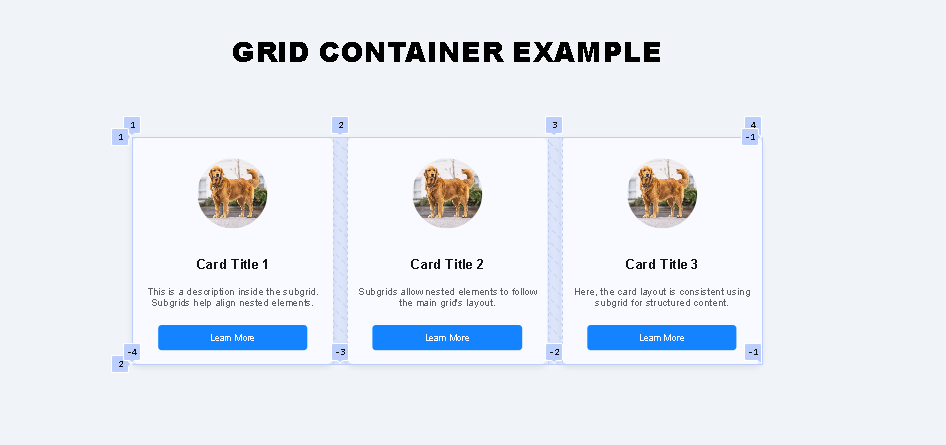
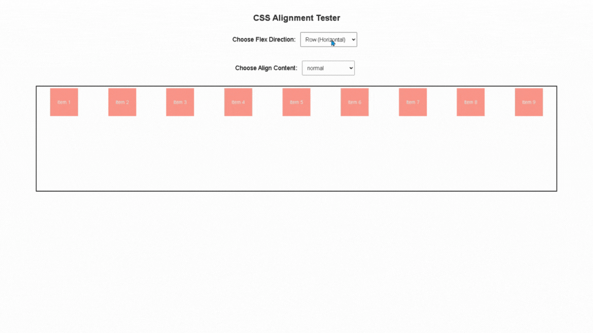

# Basic Use of CSS Features 

## **📚 Table of Contents**

1. [Use of Container Queries](#container-queries)  
2. [Use of Subgrid](#subgrid)  
3. [Use of align-content](#align-content)  
4. [References](#references)  

---

## **Introduction**  

This tutorial aims to enhance your CSS knowledge, improve your project's code structure, and help you stay up-to-date with the CSS.

### **🎯 What You'll Achieve:**  

- Master modern CSS techniques to build responsive layouts.  
- Simplify nested grid structures with Subgrid.  
- Go beyond basic `display: flex` for layout management.  
- Write cleaner, more efficient, and maintainable CSS code.

###  🛠️ Requirements:

## **1. Download and install Visual Studio Code **
- Click on the link [https://code.visualstudio.com/download]
- Click on the type of operating system you have.
  
## 2. Install Live server extension in Visual Studio Code 
- Go to Extensions Search Live Server and Click Install


## 3. Clone the Repository

Follow these simple steps to clone the repository to your local machine:

1. **Create a folder** where you want to store the cloned files:
   - You can create a folder anywhere on your computer (example, in your "Documents" or on your desktop).

2. **Open the Command Prompt**:
   - Press `Windows Key + R` to open the "Run" menu.
   - Type `cmd` and press **Enter**. This will open the Command Prompt.

3. **Clone the Repository**:
   - In the Command Prompt, use the `git clone` command to clone the repository into the folder you created:
   ```bash
   git clone https://github.com/aemrcd/CSS-Functions

## **CSS Features**

## **1. Basic Use of Container Queries**  

- #### This will show what is the difference between the three Container components in CSS 
- #### To try this process, open `Container_quiries.html`  in the *template folder* or create your own HTML file.*

 

- **Normal Container:** The image remains the same.
- **Inline-Size Container:** The image resizes based on the  container's width.
- **Size Container:** The image resizes based on both width and height.


## **2. Basic Use of grid**  



- `grid-template-columns:` Arranges 3 cards side-by-side in one row.
- `grid-template-rows:` Keeps the content organized inside each card:
   - image at the top
   - Text in the middle.
   - Buttomat the bottom.
- For better explanation open `Grid&Subgrid.html`  in the *template folder* or create your own HTML file.* 


- *if you are having trouble understanding the function there is a comment to fully understand the code it self*


## **3. Use of `align-content`**  



-  This website demonstrates how `align-content` works, whether it's applied to a column or a row.

- For better explanation open `align-content`  in the *template & static folder* or create your own HTML file.* 


## **4. References**  

- OpenAI. (2024). Updated code with flex wrap and corrected behavior: Demonstrating how align-content works in CSS Flexbox layouts. ChatGPT. https://chat.openai.com/
- MDN Web Docs. (2024, August 14). align-content - CSS: Cascading Style Sheets. Mozilla. https://developer.mozilla.org/en-US/docs/Web/CSS/align-content

--- 
